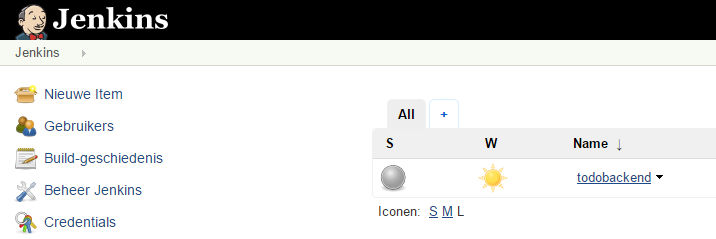
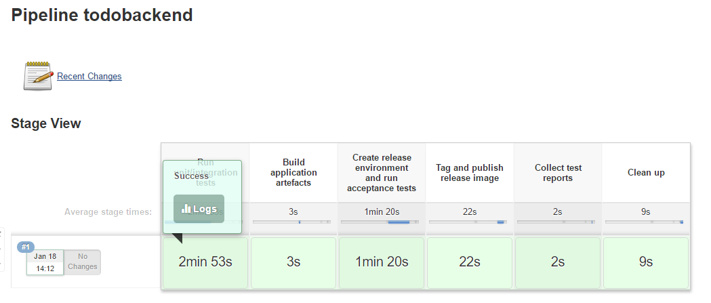
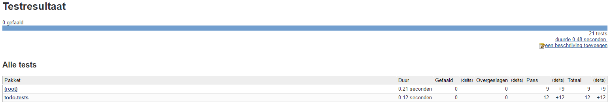
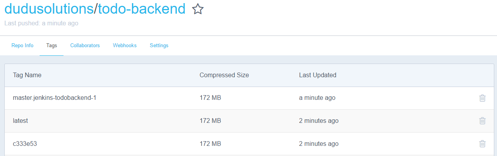

# Enterprise Linux Lab Report

- Student name: Dries Boone
- Github repo: <https://github.com/HoGentTIN/elnx-DriesB.git>

Conintuous Delivery 

## Requirements

- Remove obsolete files from CDFinal
- Add final documentation
- Final test pipeline

## Test plan

- Pipeline builds only using `vagrant up`
- Jenkins job "todobackend" is made
- Pipeline runs without errors
- New container pushed to docker hub
- Manually pull docker container and test manualy
## Documentation

- https://github.com/DhollanderJonas/Archivering01
- https://github.com/DhollanderJonas/todobackend
- https://hub.docker.com/r/dudusolutions/todo-backend/

## Test report

- Vm's and jobs are created succesfully

- Pipeline runs and tests the case
 
 
- Container is pushed to dockerhub

- When pulling and starting container case can be started succesfully

## Resources

- https://github.com/DhollanderJonas/Archivering01
- https://github.com/DhollanderJonas/todobackend
- https://hub.docker.com/r/dudusolutions/linuxtestcd/
